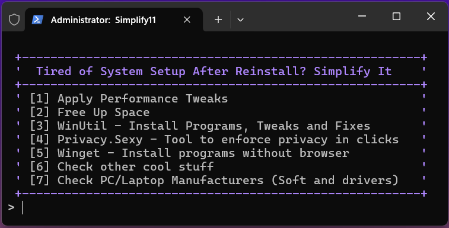

# Simplify11

<p align="center">
	<strong>A powerful Windows toolkit that quickly configures your system</strong>
</p>

<p align="center">
	
</p>

<p align="center">
	<a href="#-quick-start">Usage</a> •
	<a href="#-installation">Installation</a> •
	<a href="#-features">Features</a> •
	<a href="#-credits">Credits</a>
</p>

</div>


## 🚀 Quick Start

Launch Simplify11 with a single command in PowerShell:

```powershell
iwr "https://dub.sh/simplify11" | iex
```

## ⚡ Installation

Creates a shortcut to Start Menu that launch latest version:

```powershell
iwr "https://dub.sh/s11install" | iex
```

## ✨ Features

<details>
<summary>🛠️ Performance Tweaks</summary>

- **Storage Optimization**
	- Smart detection for SSD/HDD specific tweaks
	- TRIM optimization for SSDs
	- Intelligent prefetch management

- **Input Responsiveness**
	- Enhanced mouse precision
	- Optimized keyboard response
	- Reduced input latency

- **System Performance**
	- GPU acceleration optimization
	- Network latency reduction
	- Advanced CPU power management
	- Memory usage optimization
	- DirectX performance enhancements
</details>

<details>
<summary>💾 Space Management</summary>

- **Storage Control**
	- Reserved storage management
	- WinSxS component cleanup
	- Virtual memory optimization
</details>

<details>
<summary>📦 Software Installation</summary>

**Package System**
- Windows Package Manager integration
- Multiple manager support (Winget, UniGetUI)
- Essential software collection:

**Categories:**
- Development
- Web Browsers
- System Tools
- Productivity Suite
- Gaming Essentials
- Microsoft Core Apps

</details>

## 🔄 Integrations

<table>
<tr>
<td align="center">
<br/>
<b><a href="https://github.com/ChrisTitusTech/winutil">WinUtil</a></b><br/>
<sub>Chris Titus Windows Utility</sub>
</td>
<td align="center">
<br/>
<b><a href="https://github.com/flick9000/winscript">Winscript</a></b><br/>
<sub>Tool to build your script</sub>
</td>
<td align="center">
<br/>
<b><a href="https://github.com/undergroundwires/privacy.sexy">Privacy.sexy</a></b><br/>
<sub>Privacy enhancement</sub>
</td>
<td align="center">
<br/>
<b><a href="https://github.com/marticliment/UniGetUI">UniGetUI</a></b><br/>
<sub>Graphical Package manager</sub>
</td>
</tr>
</table>

## 🪄 Cool Stuff

- [Rectify11 Installer](https://github.com/Rectify11/Installer) - Modern UI redesign for Windows 11
- [Simplify11 Unattended](https://github.com/emylfy/simplify11/blob/main/src/docs/autounattend_guide.md) - Automated Windows installation with customizable configurations
- [WinDynamicDesktop](https://github.com/t1m0thyj/WinDynamicDesktop) - Port of macOS Dynamic Desktop Wallpapers feature
</details>

## 🌟 Credits

<div align="center">

### Built with inspiration from most unique projects

</div>

<div align="center">

| Project | Description |
|:---:|:---|
| [Win11Tweaks](https://github.com/SysadminWorld/Win11Tweaks) | My first project |
| [Latency Optimization](https://github.com/denis-g/windows10-latency-optimization) | Informative guide to optimize Windows |
| [Verified Tweaks](https://github.com/AlchemyTweaks/Verified-Tweaks) | Modifications that have been tested in videos |
| [QuickBoost](https://github.com/SanGraphic/QuickBoost) • [CoutX](https://github.com/UnLovedCookie/CoutX) • [SyncOS](https://github.com/Snowfliger/SyncOS) | Most accurate batch optimization projects |

</div>


<div align="center">

### ⭐ Love this project? Show your support by giving it a star!

#### 📫 If you have specific recommendations on how to improve or change this project or any suggestions and wishes, you can write everything in [**Issues**](https://github.com/emylfy/simplify11/issues/).
</div>