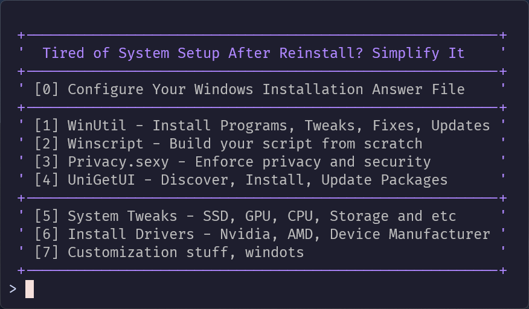

<h1>Simplify11 </h1>

**A powerful toolkit for quick setup, optimization, and personalization of Windows 11. Automates post-installation configuration, enhances system performance, and provides access to the best Windows tools in one place.**

<p align="center">
	
</p>

<p align="center">
	<a href="#-features">Features</a> •
	<a href="#-installation">Installation</a> •
	<a href="#-integrations">Integrations</a> •
	<a href="#-credits">Credits</a>
</p>

<div align="center">
 <p>
 <a href="https://github.com/emylfy/simplify11/stargazers"></a>&nbsp;&nbsp;
 <a href="https://github.com/emylfy/simplify11/"></a>&nbsp;&nbsp;
 <a href="https://github.com/emylfy/simplify11/commits/main/"></a>&nbsp;&nbsp;
 <a href="https://github.com/emylfy/simplify11/blob/main/LICENSE"></a>&nbsp;&nbsp;
 </p>
</div>


## ✨ Features

<div align="center">

### Everything you need for perfect Windows 11 setup

</div>

### 🛠️ System Configuration

- Windows installation [answer file](https://github.com/emylfy/simplify11/blob/main/docs/autounattend_guide.md) creation guide
- System performance tweaks for SSD, GPU, CPU optimization
- Driver Installation support for NVIDIA, AMD and other device manufacturers
- Customization options including [Windots](https://github.com/emylfy/windots) integration

### ⚡ Optimization

- Enhanced input responsiveness
- System performance improvements
- DirectX enhancements
- Disk space management and cleanup

### 📦 Software Management

- UniGetUI — modern graphical interface for Windows Package Manager
- Software Categories:
  - Development, Browsers, System Tools
  - Productivity, Gaming, Microsoft Apps

## ⚡ Installation

### Quick Start

Launch Simplify11 from PowerShell:

```powershell
iwr "https://dub.sh/simplify11" | iex
```

### Full Installation

Creates a shortcut in the Start Menu to launch the latest version:

```powershell
iwr "https://dub.sh/s11install" | iex
```

## 🔄 Integrations

<div align="center">

### Powerful tools in one place

</div>

<table>
<tr>
<td align="center" width="20%">
<br/>
<b><a href="https://github.com/ChrisTitusTech/winutil" title="Visit WinUtil on GitHub">WinUtil</a></b><br/>
<sub>Install programs, tweaks, fixes and updates</sub>
</td>
<td align="center" width="20%">
<br/>
<b><a href="https://github.com/flick9000/winscript" title="Visit WinScript on GitHub">WinScript</a></b><br/>
<sub>Build custom setup scripts</sub>
</td>
<td align="center" width="20%">
<br/>
<b><a href="https://github.com/Greedeks/GTweak" title="Visit GTweak on GitHub">GTweak</a></b><br/>
<sub>Tweaking tool and debloater</sub>
</td>
<td align="center" width="20%">
<br/>
<b><a href="https://github.com/undergroundwires/privacy.sexy" title="Visit Privacy.sexy on GitHub">Privacy.sexy</a></b><br/>
<sub>Security enhancement</sub>
</td>
<td align="center" width="20%">
<br/>
<b><a href="https://github.com/marticliment/UniGetUI" title="Visit UniGetUI on GitHub">UniGetUI</a></b><br/>
<sub>Discover, install and update packages</sub>
</td>
</tr>
</table>


## 🌟 Credits

<div align="center">

| Project | Description |
| :-----: | :---------: |
| [AlchemyTweaks/Verified-Tweaks](https://github.com/AlchemyTweaks/Verified-Tweaks) | A collection of verified and tested Windows modifications |
| [ashish0kumar/windots](https://github.com/ashish0kumar/windots) | Windows customization and dotfiles management |

</div>

<div align="center">

### ⭐ Love this project? Show your support by giving it a star!

#### 📫 If you have specific recommendations on how to improve or change this project or any suggestions and wishes, you can write everything in [**Issues**](https://github.com/emylfy/simplify11/issues/).

</div>