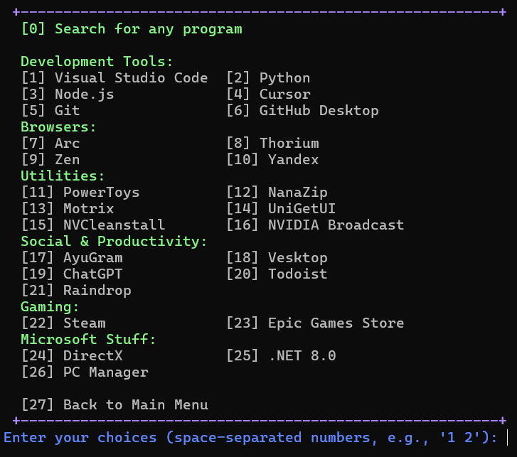

# Simplify11 ⚡

<p align="center">
	
</p>

<p align="center">
	<strong>A powerful Windows toolkit that quickly configures your system</strong>
</p>

<!-- <p align="center">
<a href="https://github.com/emylfy/simplify11/stargazers">
	</a>
<a href="https://github.com/emylfy/simplify11/network/members">
	</a>
<a href="https://github.com/emylfy/simplify11/issues">
	</a>
</p> -->

<p align="center">
	<a href="#-features">Features</a> •
	<a href="#-installation">Installation</a> •
	<a href="#-quick-start">Usage</a> •
	<a href="#-cool-stuff">Cool Stuff</a> •
	<a href="#-credits">Credits</a>
</p>

</div>

## 🚀 Quick Start

Launch Simplify11 with a single command in PowerShell:

```powershell
iwr "https://dub.sh/simplify11" | iex
```

## ⚡ Installation

Creates a shortcut to Start Menu that launch latest version:

```powershell
iwr "https://dub.sh/s11install" | iex
```

## ✨ Features

<details>
<summary>🛠️ Performance Tweaks</summary>

- **Storage Optimization**
	- Smart detection for SSD/HDD specific tweaks
	- TRIM optimization for SSDs
	- Intelligent prefetch management

- **Input Responsiveness**
	- Enhanced mouse precision
	- Optimized keyboard response
	- Reduced input latency

- **System Performance**
	- GPU acceleration optimization
	- Network latency reduction
	- Advanced CPU power management
	- Memory usage optimization
	- DirectX performance enhancements
</details>

<details>
<summary>💾 Space Management</summary>

- **Storage Control**
	- Reserved storage management
	- WinSxS component cleanup
	- Virtual memory optimization
	- Windows Update cache cleanup
	- Advanced disk cleaning utilities
</details>

<details>
<summary>📦 Software Installation</summary>

**Supports package search and installation by using Winget**
**But also contains a preset of apps such as:**



</details>

### Security Note
> 🛡️ Always create a system restore point before making system changes. Simplify11 will prompt you to create one automatically.

## 🔄 Integrations

<table>
<tr>
<td align="center">
<br/>
<b><a href="https://github.com/ChrisTitusTech/winutil">WinUtil</a></b><br/>
<sub>Best Windows Utility</sub>
</td>
<td align="center">
<br/>
<b><a href="https://github.com/undergroundwires/privacy.sexy">Privacy.sexy</a></b><br/>
<sub>Privacy enhancement</sub>
</td>
<td align="center">
<br/>
<b><a href="https://github.com/microsoft/winget-cli">Winget</a></b><br/>
<sub>Package manager</sub>
</td>
<td align="center">
<picture>
  <source
    srcset="https://assets.dub.co/brand/logo-dark.svg"
    media="(prefers-color-scheme: dark)"
  />
  <source
    srcset="https://assets.dub.co/brand/logo.svg"
    media="(prefers-color-scheme: light), (prefers-color-scheme: no-preference)"
  />
  
</picture>

<b><a href="https://app.dub.co">Dub.co</a></b><br/>
<sub>Link managment</sub>
</td>
</tr>
</table>

## 🪄 Cool Stuff

<details>
<summary>Customization</summary>

  - [Rectify11 Installer](https://github.com/Rectify11/Installer) - Modern UI redesign for Windows 11
  - [Autounattend.xml](https://gist.github.com/emylfy/d53ba22c2c8c00fe3f98887290d763e5) - Customizable Answer file to perform automated windows installation
  - [WinDynamicDesktop](https://github.com/t1m0thyj/WinDynamicDesktop) - Port of macOS Dynamic Desktop Wallpapers feature
</details>

## 🌟 Credits

<div align="center">

### Built with inspiration from most unique projects

</div>

<div align="center">

| Project | Description |
|:---:|:---|
| [Win11Tweaks](https://github.com/SysadminWorld/Win11Tweaks) | My first project |
| [Latency Optimization](https://github.com/denis-g/windows10-latency-optimization) | Informative guide to optimizing Windows |
| [Verified Tweaks](https://github.com/AlchemyTweaks/Verified-Tweaks) | Modifications that have been tested in videos |
| [QuickBoost](https://github.com/SanGraphic/QuickBoost) • [CoutX](https://github.com/UnLovedCookie/CoutX) • [SyncOS](https://github.com/Snowfliger/SyncOS) | Most accurate optimization projects |

</div>

---

<div align="center">

### ⭐ Love this project? Show your support by giving it a star!

#### ✨ If you have specific recommendations on how to improve or change this project or any suggestions and wishes, you can write everything in [**Issues**](https://github.com/emylfy/simplify11/issues/).
</div>