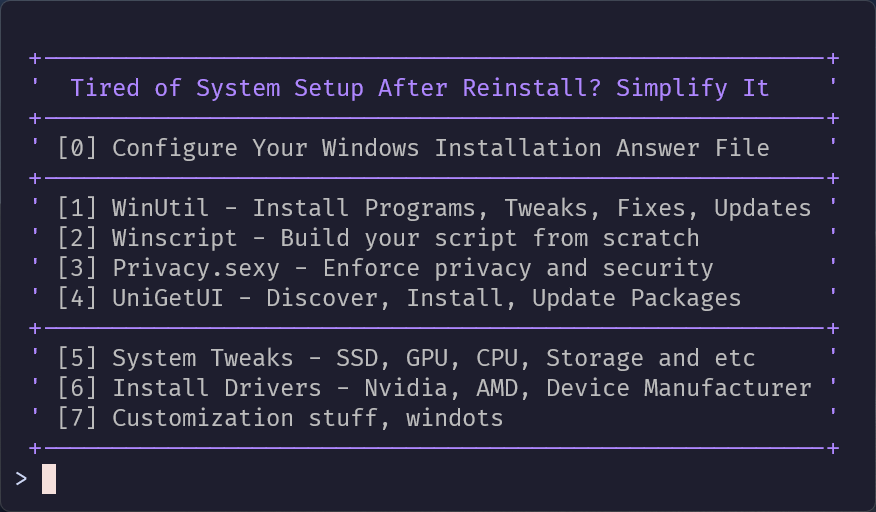

<h1>Simplify11 </h1>

**The complete Windows 11 fresh install toolkit — from ISO to fully customized desktop in one script.** Automates post-installation configuration, applies performance tweaks, installs drivers and software, and sets up your personalized desktop environment.

<p align="center">
	
</p>

<p align="center">
	<a href="#-quick-start">Quick Start</a> •
	<a href="#-what-it-does">What It Does</a> •
	<a href="#%EF%B8%8F-safety">Safety</a> •
	<a href="#-features">Features</a> •
	<a href="#-integrations">Integrations</a> •
	<a href="#-faq">FAQ</a>
</p>

<div align="center">
 <p>
 <a href="https://github.com/emylfy/simplify11/stargazers"></a>&nbsp;&nbsp;
 <a href="https://github.com/emylfy/simplify11/releases"></a>&nbsp;&nbsp;
 <a href="https://github.com/emylfy/simplify11/blob/main/LICENSE"></a>&nbsp;&nbsp;
 <a href="https://github.com/emylfy/simplify11/commits/main/"></a>&nbsp;&nbsp;
 </p>
</div>

<p align="center">
	
</p>


## ⚡ Quick Start

Launch Simplify11 directly from PowerShell:

```powershell
iwr "https://dub.sh/simplify11" | iex
```

Or install a Start Menu shortcut for quick access:

```powershell
iwr "https://dub.sh/s11install" | iex
```


## ✨ What It Does

The **only** tool that covers the entire journey from Windows ISO to finished, customized desktop:

🛠️ **System Tweaks** — 13 categories of performance optimizations for SSD, GPU, CPU, network, memory, DirectX and more. Pick exactly what you want or apply all at once.

🔒 **Security & Privacy** — Disable Windows Defender, remove Copilot & Recall, enforce privacy settings via privacy.sexy presets.

🖥️ **Drivers** — Quick links to NVIDIA, AMD, and all major OEM driver pages. Lenovo Vantage one-click install.

🎨 **Desktop Customization** — [Windots](https://github.com/emylfy/windots) integration for terminal configs, VS Code themes, Oh My Posh, FastFetch, Spotify tools, and more.

📦 **Software Management** — UniGetUI with curated app bundles (dev tools, browsers, utilities, gaming, productivity, communications).


## 🛡️ Safety

- **Automatic System Restore Point** is created before applying any tweaks
- **Selective tweaks** — choose individual categories, never forced to apply everything
- **Session logging** — every change is logged to `%USERPROFILE%\Simplify11\logs\`
- **No Windows Update changes** — updates continue to work normally
- **Open source** — every line of code is auditable

> Tested on Windows 11 24H2. Always recommended to create a manual restore point as backup.

## 📸 Screenshots

<p align="center">
	&nbsp;&nbsp;
	
</p>

<p align="center">
	
</p>


## 🔧 Features

<div align="center">

| Category | What's Included |
| :--- | :--- |
| System Latency | Interrupt steering, timer serialization |
| Input Devices | Mouse/keyboard buffer optimization, StickyKeys disable |
| SSD/NVMe | TRIM, prefetch disable, 8.3 filename disable |
| GPU | Hardware scheduling, preemption control |
| Network | Throttling bypass, lazy mode disable |
| CPU | MMCSS config, lazy mode timeout |
| Power | Throttling disable, Ultimate Performance plan, ASPM bypass |
| Memory | Large system cache, paging executive, page combining |
| DirectX | D3D11/D3D12 multithreading, deferred contexts, tiling |
| Boot | Startup delay removal, desktop switch optimization |
| UI | Auto-end tasks, reduced timeouts, instant menus |
| GPU Vendor | NVIDIA per-CPU DPC, AMD latency optimizations |
| Disk Space | Reserved storage, WinSxS cleanup, pagefile management |

</div>


## 🔄 Integrations

<div align="center">

### Powerful tools in one place

</div>

<table>
<tr>
<td align="center" width="20%">
<br/>
<b><a href="https://github.com/ChrisTitusTech/winutil" title="Visit WinUtil on GitHub">WinUtil</a></b><br/>
<sub>Install programs, tweaks, fixes and updates</sub>
</td>
<td align="center" width="20%">
<br/>
<b><a href="https://github.com/flick9000/winscript" title="Visit WinScript on GitHub">WinScript</a></b><br/>
<sub>Build custom setup scripts</sub>
</td>
<td align="center" width="20%">
<br/>
<b><a href="https://github.com/Greedeks/GTweak" title="Visit GTweak on GitHub">GTweak</a></b><br/>
<sub>Tweaking tool and debloater</sub>
</td>
<td align="center" width="20%">
<br/>
<b><a href="https://github.com/undergroundwires/privacy.sexy" title="Visit Privacy.sexy on GitHub">Privacy.sexy</a></b><br/>
<sub>Security enhancement</sub>
</td>
<td align="center" width="20%">
<br/>
<b><a href="https://github.com/marticliment/UniGetUI" title="Visit UniGetUI on GitHub">UniGetUI</a></b><br/>
<sub>Discover, install and update packages</sub>
</td>
</tr>
</table>


## 🏆 Why Simplify11?

<div align="center">

| Feature | Simplify11 | WinUtil | Win11Debloat | Sophia |
| :--- | :---: | :---: | :---: | :---: |
| ISO to Desktop pipeline | ✅ | ❌ | ❌ | ❌ |
| autounattend.xml guide | ✅ | ❌ | ❌ | ❌ |
| Desktop customization (Windots) | ✅ | ❌ | ❌ | ❌ |
| Driver installation | ✅ | ❌ | ❌ | ❌ |
| One-command launch | ✅ | ✅ | ✅ | ✅ |
| Selective tweaks | ✅ | ✅ | ✅ | ✅ |
| GUI | ❌ | ✅ | ❌ | ❌ |

</div>


## 💻 Compatibility

| Windows Version | Status |
| :---: | :---: |
| Windows 11 24H2 | Fully tested |
| Windows 11 23H2 | Supported |
| Windows 11 22H2 | Should work (not actively tested) |
| Windows 10 | Not supported |
| Insider Builds | Use at your own risk |

**Requirements:** PowerShell 5.1+ (included with Windows 11), Administrator privileges for system tweaks.


## ❓ FAQ

**Is this safe to use?**
All tweaks have been tested across multiple sources and only the most effective, well-documented registry modifications are included. A System Restore Point is created automatically before applying any tweaks.

**Can I undo the changes?**
A System Restore Point is created before tweaks are applied. You can revert to it via Settings > System > Recovery > Go Back, or by booting into Advanced Startup and choosing System Restore.

**Does this disable Windows Update?**
No. Simplify11 does not touch Windows Update settings. Updates will continue to work normally.

**Can I choose which tweaks to apply?**
Yes! The tweaks menu lets you select individual categories (SSD, GPU, CPU, Network, etc.) or apply all at once.

**Where are the logs stored?**
Session logs are saved to `%USERPROFILE%\Simplify11\logs\` with timestamps.

**Why use this instead of WinUtil or Win11Debloat?**
Simplify11 covers the entire journey from Windows ISO creation (autounattend.xml) through system tweaks and all the way to desktop customization (Windots, themes, dotfiles). No other tool offers this complete fresh-install-to-finished-desktop pipeline.


## 🤝 Contributing

See [CONTRIBUTING.md](CONTRIBUTING.md) for setup, testing, and PR guidelines.

## 🌟 Credits

<div align="center">

| Project | Description |
| :-----: | :---------: |
| [AlchemyTweaks/Verified-Tweaks](https://github.com/AlchemyTweaks/Verified-Tweaks) | A collection of verified and tested Windows modifications |
| [ashish0kumar/windots](https://github.com/ashish0kumar/windots) | Windows customization and dotfiles management |

</div>

## 📜 License

This project is licensed under the [Apache-2.0 License](LICENSE).

## ⭐ Star History

<a href="https://star-history.com/#emylfy/simplify11&Date">
 <picture>
   <source media="(prefers-color-scheme: dark)" srcset="https://api.star-history.com/svg?repos=emylfy/simplify11&type=Date&theme=dark" />
   <source media="(prefers-color-scheme: light)" srcset="https://api.star-history.com/svg?repos=emylfy/simplify11&type=Date" />
   
 </picture>
</a>

<div align="center">

### ⭐ Love this project? Show your support by giving it a star!

#### 📫 If you have specific recommendations on how to improve or change this project or any suggestions and wishes, you can write everything in [**Issues**](https://github.com/emylfy/simplify11/issues/).

</div>
