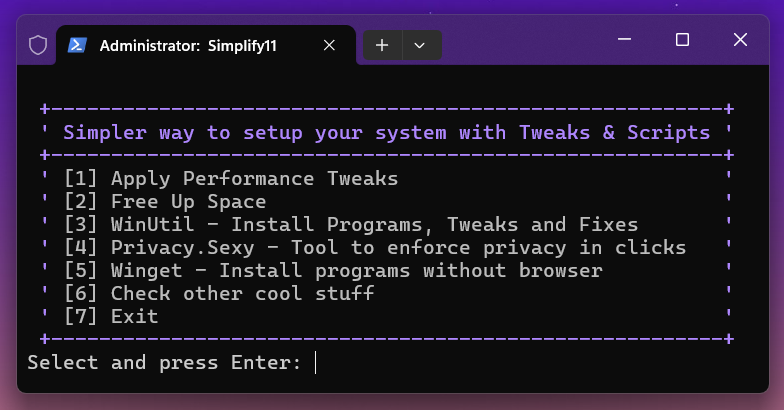

# Simplify11 ⚡

<p align="center">
	
</p>

<p align="center">
	<strong>A powerful Windows 11 optimization toolkit for enhanced performance and privacy</strong>
</p>

<p align="center">
	<a href="https://github.com/emylfy/simplify11/stargazers">
		
	</a>
	<a href="https://github.com/emylfy/simplify11/network/members">
		
	</a>
	<a href="https://github.com/emylfy/simplify11/issues">
		
	</a>
</p>

<p align="center">
	<a href="#-features">Features</a> •
	<a href="#-installation">Installation</a> •
	<a href="#-quick-start">Usage</a> •
	<a href="#-contributing">Contributing</a>
</p>

</div>

## 🚀 Quick Start

Launch Simplify11 with a single command in PowerShell:

```powershell
iwr "https://dub.sh/simplify11" | iex
```

## ⚡ Installation

Creates a shortcut to Start Menu that launch latest version:

```powershell
iwr "https://dub.sh/s11install" | iex
```

## ✨ Features

<details>
<summary>🛠️ Performance Tweaks</summary>

- **Storage Optimization**
	- Smart detection for SSD/HDD specific tweaks
	- TRIM optimization for SSDs
	- Intelligent prefetch management

- **Input Responsiveness**
	- Enhanced mouse precision
	- Optimized keyboard response
	- Reduced input latency

- **System Performance**
	- GPU acceleration optimization
	- Network latency reduction
	- Advanced CPU power management
	- Memory usage optimization
	- DirectX performance enhancements
</details>

<details>
<summary>💾 Space Management</summary>

- **Storage Control**
	- Reserved storage management
	- WinSxS component cleanup
	- Virtual memory optimization
	- Windows Update cache cleanup
	- Advanced disk cleaning utilities
</details>

<details>
<summary>📦 Software Installation</summary>

**Supports package search and installation by using Winget**
**But also contains a preset of apps such as:**

- **Development Tools**
  - Visual Studio Code, Python, Git, Node.js

- **Modern Browsers**
  - Arc, Thorium, Zen Browser

- **Essential Utilities**
  - PowerToys, NanaZip, PC Manager

- **And More...**
  - Gaming, Productivity & Social apps
</details>

### Security Note
> 🛡️ Always create a system restore point before making system changes. Simplify11 will prompt you to create one automatically.

## 🔄 Integrations

<table>
<tr>
<td align="center">
<br/>
<b>WinUtil</b><br/>
<sub>System tweaks & fixes</sub>
</td>
<td align="center">
<br/>
<b>Privacy.sexy</b><br/>
<sub>Privacy enhancement</sub>
</td>
</tr>
</table>

## 🤝 Contributing

<div align="center">

<!-- [](http://makeapullrequest.com)
[](https://github.com/emylfy/simplify11/graphs/contributors) -->

</div>

Contributions make the open source community amazing! Any contributions you make are **greatly appreciated**.

1. Fork the Project
2. Create your Feature Branch
3. Commit your Changes
4. Push to the Branch
5. Open a Pull Request

## 🌟 Acknowledgments

<div align="center">

### Built with inspiration from amazing projects

</div>

<table>
	<tr>
		<td align="center"><a href="https://github.com/SysadminWorld/Win11Tweaks">Win11Tweaks</a></td>
		<td align="center"><a href="https://github.com/denis-g/windows10-latency-optimization">Latency Optimization</a></td>
		<td align="center"><a href="https://github.com/AlchemyTweaks/Verified-Tweaks">Verified Tweaks</a></td>
	</tr>
	<tr>
		<td align="center"><a href="https://github.com/SanGraphic/QuickBoost">QuickBoost</a></td>
		<td align="center"><a href="https://github.com/UnLovedCookie/CoutX">CoutX</a></td>
		<td align="center"><a href="https://github.com/Snowfliger/SyncOS">SyncOS</a></td>
	</tr>
</table>

---

<div align="center">

### ⭐ Star on GitHub — it motivates me a lot!

</div>